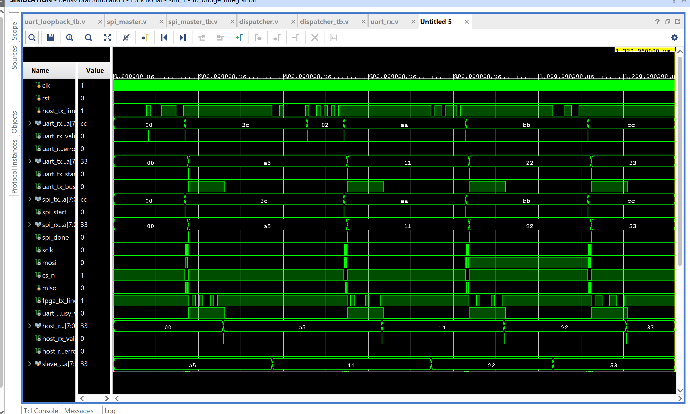
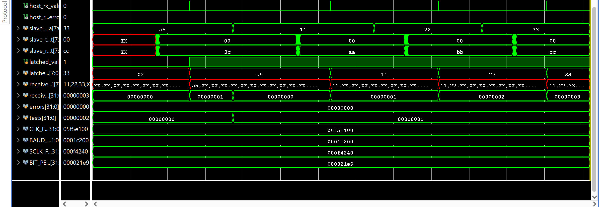
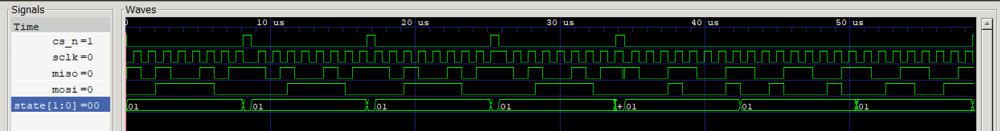
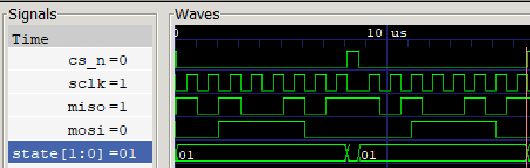
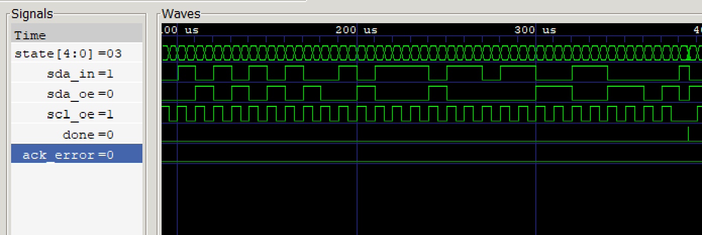
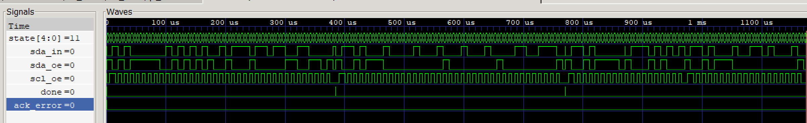
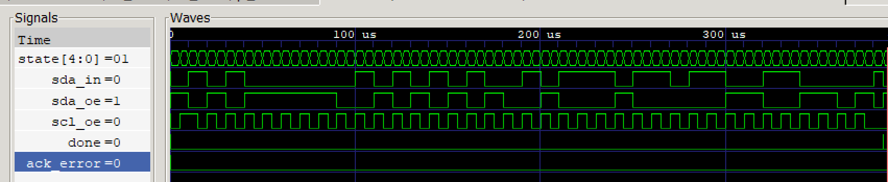
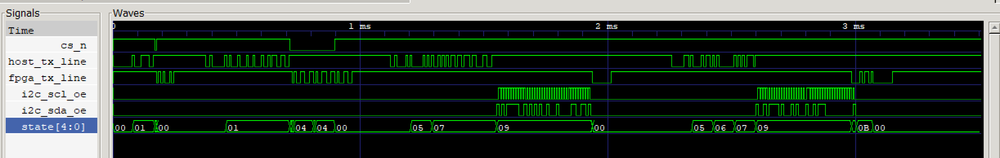
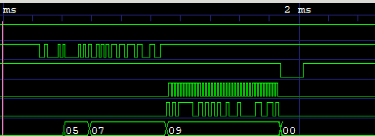
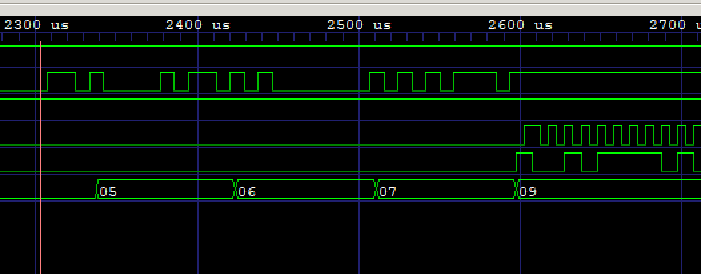

# UART-to-SPI/I2C Bridge

An FPGA module that lets a host PC control SPI and I2C peripherals over a
simple UART command interface — similar in spirit to a Bus Pirate / FT4222.

Verified in simulation (Icarus Verilog + cocotb, and Vivado XSim) and on
real hardware (Digilent Basys 3 + Arduino Uno).

## Architecture
Host (UART) ──► uart_rx ──► dispatcher ──► spi_master ──► SPI peripheral
└──► i2c_master ──► I2C peripheral
Host (UART) ◄── uart_tx ◄── dispatcher ◄───────────────────────┘

`dispatcher.v` reads a command byte from `uart_rx`, decodes which engine
(SPI or I2C) and how many bytes are involved, drives the corresponding
engine, and streams results back through `uart_tx`.

## Command byte format

`[7:6]` = engine select (`00`=SPI, `01`=I2C)

**SPI (engine=00):**
`[5]`=CPOL, `[4]`=CPHA, `[3:0]`=length−1 (total bytes, `cs_n` held low
continuously for all of them). Sequence: command → N data bytes → N
result bytes (SPI is full-duplex, one result per input byte).

**I2C (engine=01):**
`[5]`=R/W, `[4]`=reserved, `[3:0]`=length−1.
- R/W=0 (write): length = write-byte count. Sequence: command →
  device_addr → N write bytes → 1 status byte (`0x00`=success,
  `0xFF`=ack_error).
- R/W=1 (read-capable): length = read-byte count. Sequence: command →
  device_addr → write_count byte (0–15) → write_count data bytes (if
  >0) → N read bytes streamed back → 1 status byte. Covers write-only,
  read-only, and combined write-then-read (register-read pattern, via
  repeated-START) depending on which counts are zero.

## Waveforms

### SPI

**Test 1 — Single-byte SPI transfer (full view):** `cs_n` drops for one byte, `sclk`/`mosi`/`miso` active throughout.

**Test 1 — Single-byte SPI transfer (zoomed):** close-up of the same transaction.

**Test 2 — All 4 SPI modes (CPOL/CPHA) tested back-to-back:** wide view showing multiple transactions.

**Test 2 — Gap between transactions (zoomed):** confirms `sclk` goes silent when `cs_n` is idle between separate transfers.

### I2C

**Test 3 — I2C write transaction (wide view):** device address + data bytes, each ACKed.

**Test 4 — I2C combined write-then-read, register-read pattern (wide view):** write phase, repeated-START, read phase, all in one continuous transaction.

**Test 4 — Repeated-START sequence (zoomed):** `state` stepping through `RSTART_PREP` → `RSTART_SCLHIGH` → `RSTART_SDALOW` → `RSTART_SCLLOW` before re-sending the address with R/W=1.

### Full bridge integration

**All 4 tests in one continuous simulation run (wide view):** SPI single-byte, SPI multi-byte, I2C write, I2C combined — back to back.

**Zoomed view of the integration run:** closer look at signal activity during one of the transactions.

**Dispatcher branch confirmation (zoomed):** `disp_inst.state` visibly takes a different path (`05→06→07→09` vs `05→07→09`) depending on whether the command uses R/W=0 or R/W=1 — confirmed at the signal level, not just inferred from a PASS message.

